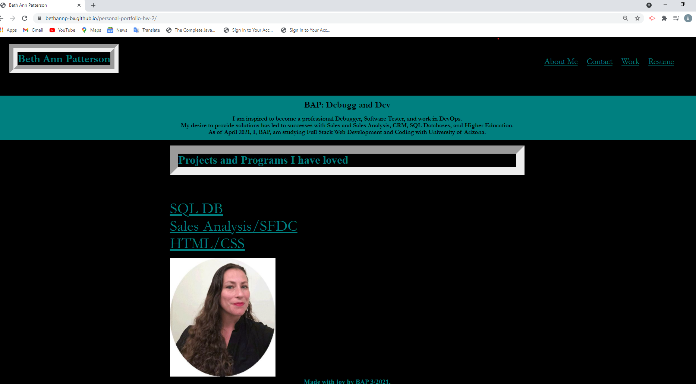

# Personal-Portfolio-HW-2

Created an MVP Personal Portfolio through these methods:

- Created repository in Github
- Identified github pages were not published, and my folder structure after many commits, was not correct. I deleted the first repo and cloned my work into the new repo.
- Developed a personal porfolio to be a minimally viable product to the mock up provided and with responsive layout that adopts to viewport.
- Added alt text to image.
- Added resume, linkedin for contact me, work link to navigate to projects and programs, ensure the about me linked to a decription of me.
- Added hover and zoom on the applications so that it was larger sized than other text on the page, per the assignment.

## Deployed URL and Repo URL:

https://bethannp-bx.github.io/personal-portfolio-hw-2/

https://github.com/BethAnnP-Bx/personal-portfolio-hw-2

## User Stor

AS AN employer
I WANT to view a potential employee's deployed portfolio of work samples
SO THAT I can review samples of their work and assess whether they're a good candidate for an open position

## Acceptance Criteria

GIVEN I need to sample a potential employee's previous work
WHEN I load their portfolio
THEN I am presented with the developer's name, a recent photo, and links to sections about them, their work, and how to contact them
WHEN I click one of the links in the navigation
THEN the UI scrolls to the corresponding section
WHEN I click on the link to the section about their work
THEN the UI scrolls to a section with titled images of the developer's applications
WHEN I am presented with the developer's first application
THEN that application's image should be larger in size than the others
WHEN I click on the images of the applications
THEN I am taken to that deployed application
WHEN I resize the page or view the site on various screens and devices
THEN I am presented with a responsive layout that adapts to my viewport

## Screenshot

## Personal review of this challenge and will submit as it stands - notes to the grader

- Observed responsiveness is not optimized on smaller screens as intended
- Each application of "projects" linked should have its own zoom hover. Although it does satisfy the user acceptance criteria that the "image", in this case the text is larger on hover for example on "SQL".
- The "about me" section link will not navigate when on a large screen, but on a smaller screen click "about me" link in header nav and it does navigate to this section successfully.
- All styles need much work to be polished and flex should have been implemented not nav. I could not employ succesful flex boxes and switched to a second nav section to implement functionality similar to mock up.
